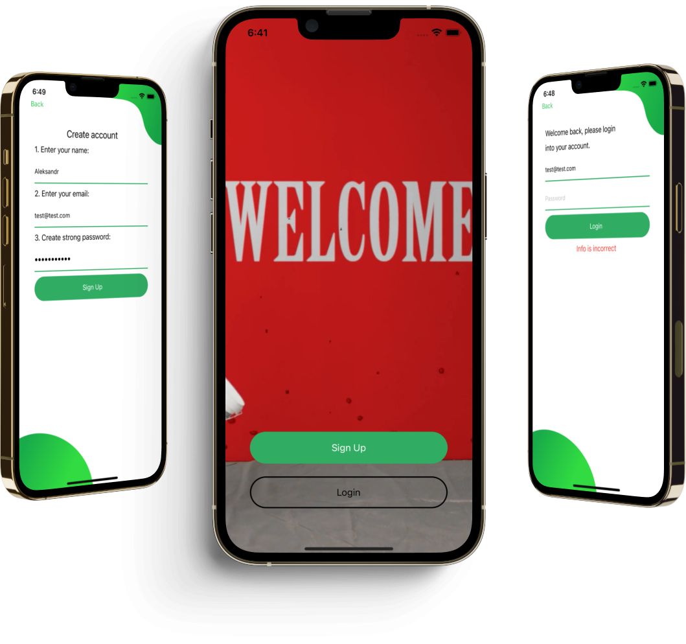

# RegistrationDB

## Introduction

Hi, my name is Aleksandr. I'm glad to see you on my [GitHub](https://github.com/AleksandrBasov?tab=repositories).

## Features

The application is developed in Swift language. I used MVC architecture in my project. On the first screen, I used AVPlayer to show a welcome video in the background.

<h1 align="center">

  </h1>
  
For my project, I used the FireBase framework, on the server of which I store user data and their tasks.
After registration, the email address and username are saved on the server. 

<h1 align="center">

 
